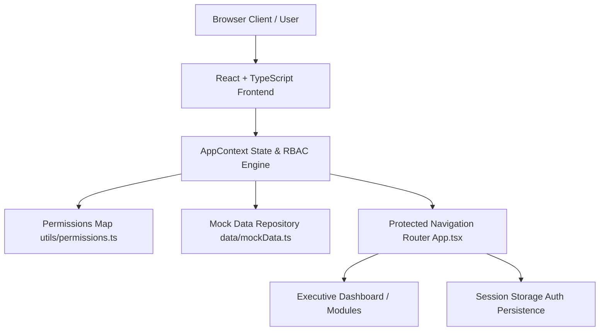
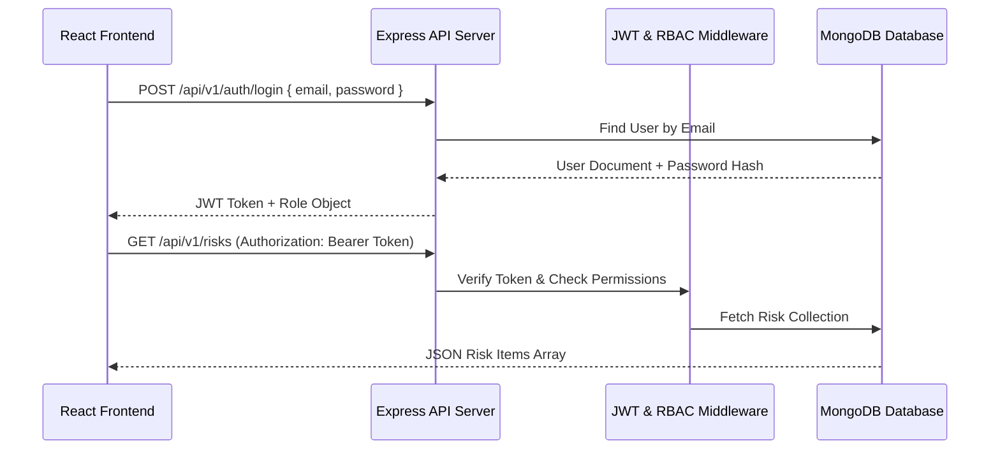

# Enterprise Authority — Strategy, GRC & BCM Operating Suite
## Technical Architecture, Functional Specifications & RBAC Documentation

---

> **Enterprise Platform Status**: Sovereign Grade Prototype  
> **Compliance Benchmarks**: ISO 31000 (ERM), ISO 22301 (BCM), NCA ECC (Cybersecurity Controls)  
> **Tech Stack**: React 18, TypeScript, Vite, Tailwind CSS, Recharts, Lucide Icons, React Router  

---

## 1. Executive Summary

**Enterprise Authority GRC & Strategy Suite** is a high-fidelity, sovereign-grade enterprise SaaS dashboard platform designed for institutional leadership, executive committees, risk managers, auditors, and department heads. 

The platform integrates six core organizational domains into a single pane of glass:
1. **Strategic Execution & OKRs** (Institutional Performance & Initiative Masterplan)
2. **Enterprise Risk Management (ERM)** (ISO 31000 5×5 Matrix & Severity Breakdown)
3. **Cybersecurity Risk Oversight** (NCA ECC Compliance & Threat Exposure)
4. **Corporate Governance & Policies** (Board Committee Meetings & Policy Renewal)
5. **Business Continuity Management (BCM)** (ISO 22301 BIA & Recovery Time Objectives)
6. **Centralized Action Item Governance** (Cross-Domain Corrective Action Tracking)

---

## 2. Technical Architecture & Tech Stack



### Stack Breakdown
- **UI Framework**: React 18 (TypeScript)
- **Bundler & Dev Server**: Vite 6
- **Styling**: Tailwind CSS (Executive Navy & Slate Palette)
- **Data Visualization**: Recharts (OKR Trajectory, Objective Portfolios, Performance Trends)
- **Icons**: Lucide React Icons
- **Notifications**: Sonner Toast Engine
- **Navigation**: React Router 6 with `ProtectedRoute` wrappers

---

## 3. Role-Based Access Control (RBAC) Architecture

The platform enforces strict persona-based access gating across all routes, actions, modals, and data modification features.

### Persona Definitions & Permission Matrix

| Role Persona | Role Description | Allowed Navigation Routes | Key Write Permissions | Read-Only |
| :--- | :--- | :--- | :--- | :---: |
| **Executive** | C-Level Oversight & Strategic Governance | `All Routes` (`/`, `/strategy`, `/performance`, `/enterprise-risk`, `/cyber-risk`, `/governance`, `/compliance`, `/bcm`, `/actions`, `/tasks`, `/documents`, `/reports`, `/admin`) | `canCreateRisk`, `canCreateAction`, `canManageUsers` | ❌ |
| **Risk Manager** | ERM & Cyber Exposure Coordinator | `/`, `/enterprise-risk`, `/cyber-risk`, `/actions`, `/reports` | `canCreateRisk`, `canCreateAction` | ❌ |
| **Department Head** | Operational & Tactical Execution Owner | `/`, `/strategy`, `/performance`, `/actions`, `/tasks`, `/documents` | `canCreateAction` | ❌ |
| **Auditor** | Independent Regulatory Compliance Inspector | `/`, `/compliance`, `/governance`, `/reports`, `/documents` | None (View & Audit Only) | ✅ |
| **Viewer** | Enterprise Read-Only Stakeholder | `/`, `/strategy`, `/performance` | None (View Only) | ✅ |

### Security Gating Implementations
1. **Unauthenticated Redirect**: Unauthenticated requests to any route are intercepted and redirected to `/login`.
2. **Session Persistence**: Session status and active persona are persisted in `sessionStorage` (`eda_auth` and `eda_user`).
3. **Access Denied View**: Attempts to access unauthorized routes trigger an **RBAC Access Denied Screen** showing the user's role limits.
4. **Read-Only Disablement**: Write buttons (*Register Risk*, *New Action Plan*, status dropdowns) automatically hide or disable for `Auditor` and `Viewer` personas.

---

## 4. Core System Modules

### 4.1 Executive Command Center (`DashboardPage.tsx`)
- **Institutional Scorecard**: 8 Key Performance Indicators (Institutional Performance 88.4%, Strategic OKRs, Risk Exposures, NCA ECC Compliance 96.5%, BCM Readiness 91.6%).
- **Interactive 5×5 Matrix & Heatmap**: Integrated ISO 31000 matrix with cell filtering.
- **OKR Execution Trajectory Chart**: Monthly target vs. actual strategy execution trends.

### 4.2 Strategic Performance & OKRs (`StrategyPage.tsx` & `PerformancePage.tsx`)
- **Cascade Tree**: Multi-level strategic themes, objective nodes, initiatives, and key result metrics.
- **Capital Expenditure Tracking**: SAR 385.0M allocated budget tracking with progress indexing.

### 4.3 ISO 31000 Enterprise Risk Register (`EnterpriseRiskPage.tsx`)
- **Dual Representation Heatmap**: 
  - *Matrix View*: Sleek ISO 31000 Likelihood × Impact grid with subtle color tones and count tags.
  - *Severity Breakdown View*: Executive exposure progress bar and severity cards (Critical, High, Moderate, Low).
- **Inherent vs. Residual Scoring**: Pre-control vs. post-control evaluation.

### 4.4 Cybersecurity Risk Oversight (`CyberRiskPage.tsx` & `CompliancePage.tsx`)
- **NCA ECC Compliance**: Audit tracking across 108 of 112 mandatory controls.
- **Threat Vector Monitoring**: Ransomware, Cloud Security, Vendor API Risks, and SOC Alert monitoring.

### 4.5 Corporate Governance (`GovernancePage.tsx`)
- **Board Committee Oversight**: Audit Committee, Strategy Committee, ERM Committee meeting schedules.
- **Policy Lifecycle**: Governance policy renewal and compliance index.

### 4.6 ISO 22301 Business Continuity (`BCMPage.tsx`)
- **Business Impact Analysis (BIA)**: RTO (Recovery Time Objective) and RPO (Recovery Point Objective) tracking.
- **Disaster Recovery Tabletop Exercises**: Quarterly tabletop testing validation.

### 4.7 Cross-Domain Action Plan Governance (`ActionsPage.tsx`)
- **Central Action Register**: Consolidated action plans sourced from ERM, Cyber, Strategy, Governance, Compliance, and BCM.
- **Interactive Status Management**: Real-time progress updates (`Not Started`, `In Progress`, `Under Review`, `Completed`).

### 4.8 Executive Reports & Artifact Generator (`ReportsPage.tsx`)
- **Official Artifacts**: Instant preview and PDF/Excel generation for executive board reporting.

---

## 5. Design System & Aesthetic Standards

- **Theme Palette**: Executive Navy & Slate (`slate-950`, `blue-900`, `blue-800`, `slate-900`).
- **Typography**: Clean modern typography with Google Inter fallback and tabular monospace fonts for metrics (`font-mono`).
- **Glassmorphism Authentication**: Ambient gradients, blur overlays, and persona selector buttons on `/login`.
- **Status Badges**: Standardized status pill indicators (`Completed`, `In Progress`, `On Track`, `Critical`).

---

## 6. MERN Backend Integration Roadmap

To transition this frontend prototype to a full production MERN backend:



### Steps for MERN Backend Integration:
1. **API Client Setup**: Replace `AppContext` state initialization with `axios` or `fetch` calls to `/api/v1/...`.
2. **MongoDB Schemas**:
   - `UserSchema` (email, passwordHash, role, department, permissions)
   - `RiskSchema` (code, title, category, likelihood, impact, inherentScore, residualScore, status, owner)
   - `ActionSchema` (code, title, source, priority, progress, status, owner, dueDate)
   - `ObjectiveSchema` (code, title, theme, targetYear, progress, status)
3. **Authentication**: Issue signed JWT tokens stored in `httpOnly` cookies or headers.
4. **RBAC Middleware**: Add backend `authorize('Executive', 'Risk Manager')` middleware guards on Express API endpoints.

---

## 7. Setup & Execution Guide

### Prerequisite Dependencies
- Node.js (v18+ recommended)
- npm or yarn

### Installation & Execution Commands

```bash
# 1. Install Dependencies
npm install

# 2. Run Local Development Server
npm run dev

# 3. Compile Production Bundle
npm run build
```

---

*Documentation prepared for Enterprise Development Authority Technical Board.*
